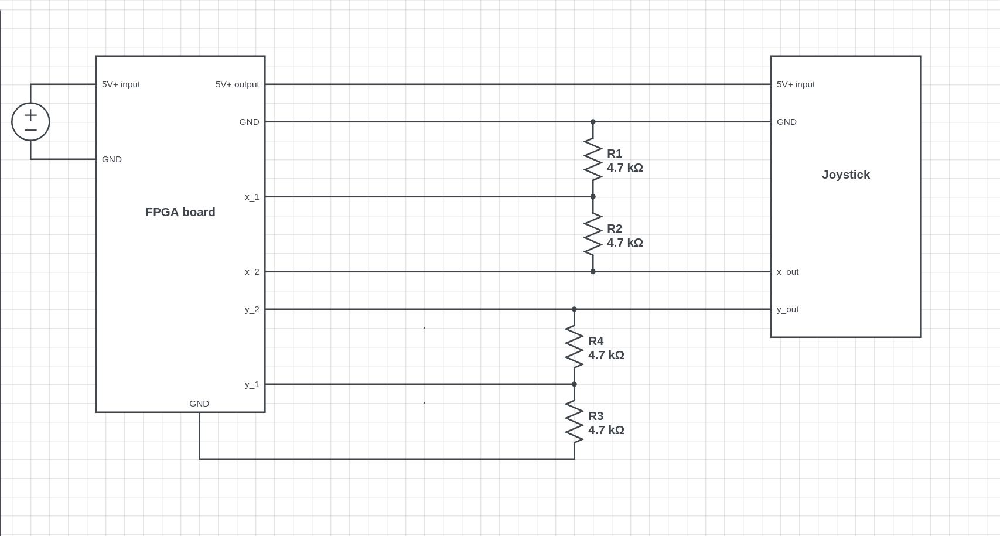
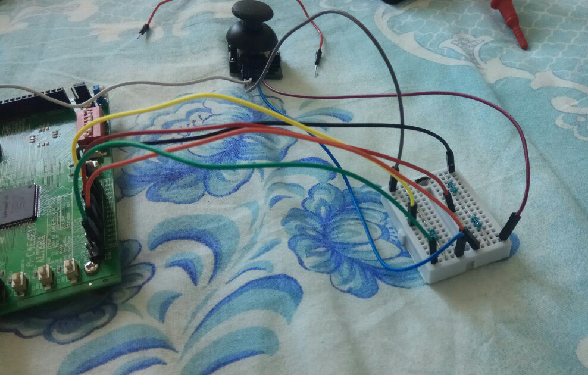

# The Snake game for FPGA Cyclone IV (with VGA & SPI joystick)

## Introduction

Do you remember the [snake game](https://en.wikipedia.org/wiki/Snake_(video_game_genre)) from childhood, where a snake runs on the screen trying to eat an apple? This article describes our implementation of the game on an FPGA<sup>[1](#1)</sup>.

But first, let us introduce ourselves and explain the rationale why we have worked on the project. There are 3 of us: [Tymur Lysenko](https://github.com/Sitiritis), [Daniil Manakovskiy](https://github.com/WinnerOK) and [Sergey Makarov](https://github.com/SgMakarov). As first-year students of [Innopolis University](https://university.innopolis.ru/en/), we had a course in "Computer Architecture", which is taught professionally and can allow a learner to understand what is happening at the low level of a computer. At some point during the course, the teaching staff provided students with the opportunity to develop a project for an FPGA for additional points in the course. Of course, our motivation has not been only the grade, but our interest as future engineers to produce a work that might be used by others, acquire more experience in the hardware design, and finally, enjoy playing the game in the end :)

Now, let us go "into dark deep details..."

## Project overview

For our project we decided to pick an easily implementable and fun game, namely a "Snake" game, where an input is taken from an SPI joystick and processed, a picture is being outputted to a VGA monitor, and a score is shown on a 7-segment display (in hex). The game logic is intuitive and straightforward, not taking into consideration VGA and the joystick, which were interesting challenges, and implementing them led to a good gaming experience.


As mentioned, the game logic is simple. A player starts with a single snake's head. The goal is to eat apples. They are being randomly generated on the screen after a previous one was eaten. Additionally, the snake is being extended by 1 tail after satisfying the hunger. Tails move one after another, following the head. The snake is always moving. If the screen borders were reached the snake is being transferred to another side of the screen. If the head hits a tail - the game is over.

## Tools used
- Altera Cyclone IV (EP4CE6E22C8N) with 6272 logical elements, on-board 50 MHz clock, 3-bit color VGA, 8 digit 7-segment display. The FPGA can't take an analog input to its pins
- SPI Joystick (KY-023)
- A VGA monitor that supports 60 Hz refresh rate
- Quartus Prime Lite Edition 18.0.0 Build 614
- Verilog HDL IEEE 1364-2001
- Breadboard
- Electrical elements:
  - 8 male-female connectors
  - 1 female-female connector
  - 1 male-male connector
  - 4 resistors (4.7 KΩ)

## Architecture overview

The first point to consider about the project is its architecture. Here is how it looks from the top level point of view:

<a href="Design.pdf">


</a>

As you can see, there are many inputs, outputs, and some modules. Let us describe what each means. Along the way, we will specify which pins were used on the board for ports.

### Main inputs

The main inputs needed for the implementation are *res_x_one*, *res_x_two*, *res_y_one*, *res_y_two*, which are used receive a current direction of a joystick:

| Input     | Left | Right | Up | Down | No change in direction |
|-----------|:----:|:-----:|:--:|:----:|:----------------------:|
| res_x_one (PIN_30) |1|0|x|x|1|
| res_x_two (PIN_52) |1|0|x|x|0|
| res_y_one (PIN_39) |x|x|1|0|1|
| res_y_two (PIN_44) |x|x|1|0|0|

### Other inputs

- clk - the board clock (PIN_23)
- reset - signal to reset the game and stop printing (PIN_58)
- color - when 1 all possible colours are being output to the screen, used only for demonstration purposes (PIN_68)

### Main modules

#### joystick_input

Is used to produce a direction code based on an input from the joystick.

#### game_logic

game_logic contains all logic needed to play a game. It moves snake in a given direction. Additionally, it is responsible for an apple eating and collision detection. Furthermore, it receives current x and y coordinates of a pixel on the screen and returns an entity placed at the position.

#### VGA_Draw

The drawer sets a color of a pixel to a particular value based on current position (_iVGA\_X, iVGA\_Y_) and current entity (_ent_).

#### VGA_Ctrl

Generates a control bitstream to VGA output (_V\_Sync, H\_Sync, R, G, B_)

#### SSEG_Display<sup>[2](#2)</sup>

Driver to output current score on the 7-segment display.

#### VGA_clk

Receives a 50MHz clock and cuts it down to 25.175 MHz.

#### game_upd_clk

The module that generates a special clock which triggers an update of a game state.

### Outputs

- VGA_B - VGA blue pin (PIN_144)
- VGA_G - VGA green pin (PIN_1)
- VGA_R - VGA red pin (PIN_2)
- VGA_HS - VGA horizontal synchronization (PIN_142)
- VGA_VS - VGA vertical synchronization (PIN_143)
- sseg_a_to_dp - specifies which of 8 segments to light (PIN_115, PIN_119, PIN_120, PIN_121, PIN_124, PIN_125, PIN_126, PIN_127)
- sseg_an - specifies which of 4 7-segment display is to be used (PIN_128, PIN_129, PIN_132, PIN_133)

## Implementation

### Input with SPI joystick


While implementing an input module, we found out that stick provides an analog signal. It has 3 positions for each axis:

- top — ~5V output
- mid — ~2.5V output
- low — ~0V output

It is very similar to the ternary system: for the X-axis, we have true (left), false (right) and undetermined state, where the joystick is neither on left nor on right position. The problem is that the FPGA board can only process digital, so we can not convert this ternary logic to binary just by writing some code. The first idea was to find an Analog-Digital converter, but then we decided to use our school knowledge of physics and implement the voltage divider<sup>[3](#3)</sup>. To define three states we will need two bits: 00 is false, 01 is undefined and 11 is true. After some measurements we found out that on our board border between zero and one is approximately 1.7V, so we built the following scheme (image created using circuitlab<sup>[4](#4)</sup>):




Which we implemented using items from an Arduino kit:



Our circuit takes one input for each axis and produces two outputs: first comes directly from stick and becomes zero only if joystick outputs zero. Second is 0 on undetermined state, but still 1 on true – exactly what we need.

Logic is pretty simple:

1. We translate our ternary logic to simple binary wires for each direction;
2. Every clock cycle we check whether only one direction is true (Snake cannot go by diagonal);
3. We compare our new direction with previous for snake not to eat itself and if it is fine to change the direction.

<details>
<summary>Input module</summary>

```Verilog
//initialization of module and inputs
reg left, right, up, down;

initial
begin
	direction = `TOP_DIR;
end

always @(posedge clk)
begin
	//1
	left = two_resistors_x;
	right = ~one_resistor_x;
	up = two_resistors_y;
	down = ~one_resistor_y;
	if (left + right + up + down == 3'b001) //2
	begin
		if (left && (direction != `RIGHT_DIR)) //3
		begin
			direction = `LEFT_DIR;
		end
		//same code for other directions
	end
end
```

</details>

### Output to VGA
We decided to make an output with resolution 640x480 at 60Hz screen running at 60 FPS.

VGA module consists of 2 main parts: **driver** and **drawer**. Driver generates a bitstream consisting of vertical, horizontal synchronization signals, and color that is given to VGA outputs. There is an article<sup>[5](#5)</sup> by [@SlavikMIPT](https://habr.com/users/SlavikMIPT/) that describes the basic principles of working with VGA. We have adapted the driver from the article to our board.

We decided to break down the screen into a 40x30 elements grid, consisting of squares 16x16 pixels. Each element stands for 1 game entity: either an apple, snake's head, tail or nothing.

The next step in our implementation was to create sprites for the entities.

Cyclone IV has only 3 bits to represent a color on VGA (1 for Red, 1 for Green, and 1 for Blue). Due to such limitation, we needed to implement the converter to fit colors of an original image into available ones. For that purpose, we created a python script that divides an RGB value of every pixel by 128.

<details>
<summary>Python script</summary>


```Python
from PIL import Image, ImageDraw

filename = "snake_head"
index = 1

im = Image.open(filename + ".png")
n = Image.new('RGB', (16, 16))
d = ImageDraw.Draw(n)

pix = im.load()
size = im.size

data = []

code = "sp[" + str(index) + "][{i}][{j}] = 3'b{RGB};\\\n"

with open("code_" + filename + ".txt", 'w') as f:
	for i in range(size[0]):
		tmp = []
		for j in range(size[1]):
			clr = im.getpixel((i, j))
			vg = "{0}{1}{2}".format(int(clr[0] / 128),  # an array representation for pixel
									int(clr[1] / 128),  # since clr[*] in range [0, 255],
									int(clr[2] / 128))  # clr[*]/128 is either 0 or 1
			tmp.append(vg)
			f.write(code.format(i=i, j=j, RGB=vg))  # Verilog code to initialization
			d.point((i, j), tuple([int(vg[0]) * 255, int(vg[1]) * 255, int(vg[2]) * 255]))  # Visualize final image
		data.append(tmp)

n.save(filename + "_3bit.png")

for el in data:
	print(" ".join(el))

```
</details>

#### Comparison between input and output
<table>
  <tr align="center">
    <td>Original</td>
    <td>After the script</td>
  </tr>
  <tr align="center">
    <td height="128" width="150">
      
    </td>
    <td height="128" width="150">
      
    </td>
  </tr>
</table>

The main purpose of drawer is to send a color of a pixel to VGA based on current position (_iVGA_X, iVGA_Y_) and current entity(_ent_). All sprites are hard-coded but can be easily changed by generating a new code using the script above.

<details>
<summary>Drawer logic</summary>

```Verilog
always @(posedge iVGA_CLK or posedge reset)
begin
	if(reset)
	begin
		oRed   <= 0;
		oGreen <= 0;
		oBlue  <= 0;
	end
	else
	begin
		// DRAW CURRENT STATE
		if (ent == `ENT_NOTHING)
		begin
			oRed   <= 1;
			oGreen <= 1;
			oBlue  <= 1;
		end
		else
		begin
			// Drawing a particular pixel from sprite
			oRed <= sp[ent][iVGA_X % `H_SQUARE][iVGA_Y % `V_SQUARE][0];
			oGreen <= sp[ent][iVGA_X % `H_SQUARE][iVGA_Y % `V_SQUARE][1];
			oBlue <= sp[ent][iVGA_X % `H_SQUARE][iVGA_Y % `V_SQUARE][2];
		end
	end
end
```

</details>

### Output to the 7-segment display
Right before the deadline, we decided to output a game score to the 7-segment display. Due to lack of time, we decided to use the code from EP4CE6 Starter Board Documentation<sup>[2](#2)</sup>. This module outputs a hexadecimal number to the display.

### Game logic

During the development, we tried several approaches, however, we ended up with the one that requires a minimal amount of memory and is quite easy to implement in hardware and make computations parallel.

As VGA draws a pixel at each clock cycle starting from the left top one, going to the right bottom, the VGA_Draw module, which is responsible for producing a color for a pixel, needs to identify which color to use for current coordinates. That's what the game logic module should output - an entity code for the given coordinates.

Nevertheless, it is not a single function of the module. Additionally, it has to update the game state sometimes. It can be updated only after the full screen was drawn. That's where game_upd_clk module comes in. A signal produced by this module is used to determine when to update.

#### Game state

Game state consists of:
  - Coordinates of snake's head
  - An array of coordinates of snake's tail. The array is limited by 128 elements in our implementation
  - Number of tails
  - Coordinates of an apple
  - Game over flag
  - Game won flag

The update of the game state includes several stages:
  1. Move the snake's head to new coordinates, based on a given direction. If it turned out that some coordinate is on its edge and it needs to be changed further, then the head has to jump on another edge of the screen. For example, a direction is set to the left, and the current X coordinate is 0. Therefore, the new X coordinate should become equal to the last horizontal address.
  2. New coordinates of the snake's head are tested against apple coordinates:  
    2.1. In case they are equal and the array is not full - add a new tail to the array and increment tail counter. When the counter reaches its highest value (128 in our case), game won flag is being set up and that means, that snake cannot grow anymore, but the game still continues. The new tail is being placed on the previous coordinates of the snake's head. Random coordinates for X and Y should be taken to place an apple there. 
    2.2. In case they are not equal - sequentially swap coordinates of the adjacent tails. (n + 1)-th tail should receive coordinates of n-th, in case n-th tail was added before (n + 1)-th. The first tail receives old coordinates of the head.
  3. Check, if new coordinates of the snake's head coincide with coordinates of any tail. If that is the case, the game over flag is raised and the game stops.

#### Random coordinate generation

Random numbers produced by taking random bits generated by 6-bit _linear-feedback shift registers (LFSR)_<sup>[6](#6)</sup>. To fit the numbers into a screen they are being divided by the dimensions of the game grid and the remainder is taken.

## Conclusion

After 8 weeks of hard work, we can finally say, that the project was successfully implemented. We got some experience in game development and ended up with an enjoyable version of a "Snake" game for an FPGA. The game is playable, and our skills in programming, designing an architecture and have soft-skills improved.

## Acknowledgements

We would like to express our special thanks of gratitude to our professors [Muhammad Fahim](https://scholar.google.com/citations?user=HFp8hzMAAAAJ) and [Alexander Tormasov](https://scholar.google.com/citations?user=bsy2_u0AAAAJ) for giving us knowledge and opportunity to put them into practice. We heartily thank [Vladislav Ostankovich](https://github.com/vladostan/) for providing us with essential hardware used in the project and [Temur Kholmatov](https://github.com/temur-kh/) for helping with debugging. We would not forget to remember [Anastassiya Boiko](https://github.com/Rikitariko) drawing beautiful sprites for the game. Also, we would like to extend our sincere esteems to Rabab Marouf for the proofreading and editing this article.

Thanks to all who helped us test the game and tried to set records, hope you enjoy playing it!

## References

<a name="1"></a>[1]: [Project on the Github](https://github.com/Sitiritis/SnakeGame_FPGA)  
<a name="2"></a>[2]: [\[FPGA\] EP4CE6 Starter Board Documentation](https://drive.google.com/file/d/0B29qKrGuvpGDcEx3QjVUNG9qRVE/view)  
<a name="3"></a>[3]: [Voltage divider](http://www.joyta.ru/7328-delitel-napryazheniya-na-rezistorax-raschet-onlajn)  
<a name="4"></a>[4]: [Tool for modelling circuits](https://circuitlab.com)  
<a name="5"></a>[5]: [VGA адаптер на ПЛИС Altera Cyclone III](https://habr.com/post/157863/)  
<a name="6"></a>[6]: [Linear-feedback shift register (LFSR) on Wikipedia](https://en.wikipedia.org/wiki/Linear-feedback_shift_register)  
[LFSR in an FPGA - VHDL & Verilog Code](https://www.nandland.com/vhdl/modules/lfsr-linear-feedback-shift-register.html)  
[An apple texture](https://winterlynx.itch.io/dungeon-crawler-24-pack)  
[Idea to generate random numbers](http://simplefpga.blogspot.com/2013/02/random-number-generator-in-verilog-fpga.html)  
Palnitkar, S. (2003). _Verilog HDL: A Guide to Digital Design and Synthesis, Second Edition._
