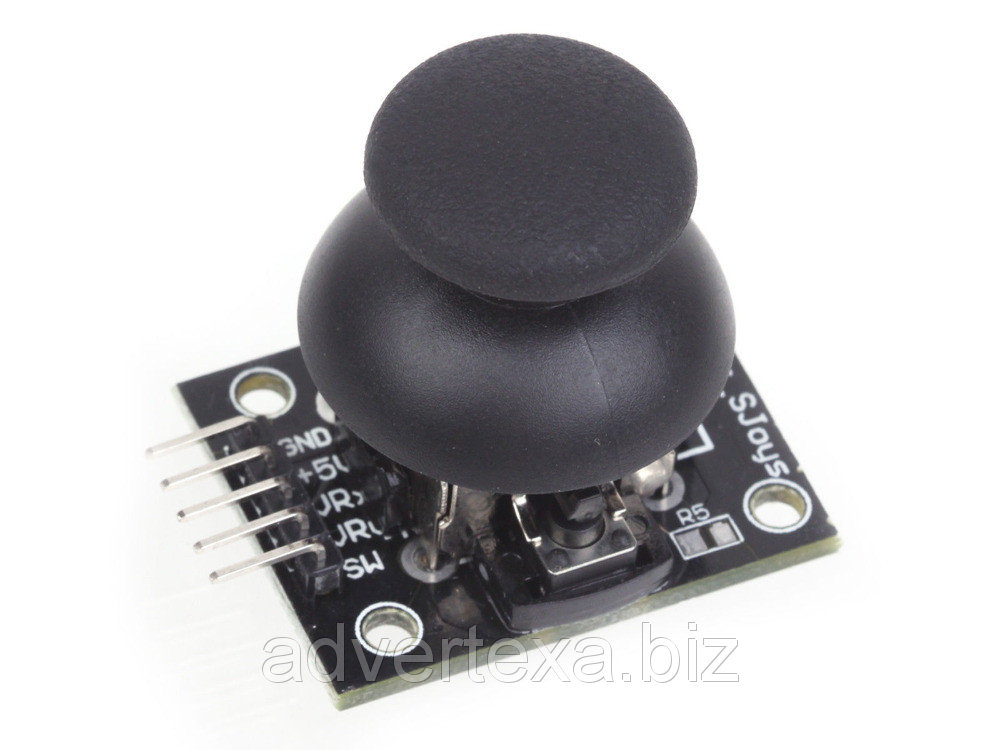

# The Snake game for FPGA Cyclone IV (with VGA & SPI joystick)

## Introduction

Remember a [snake game](https://en.wikipedia.org/wiki/Snake_(video_game_genre)) from childhood, where a snake runs on the screen trying to eat an apple? This article describes an implementation of the game on an FPGA.

But first, let us present ourselves and explain why were we working on the project. There are 3 of us: [Tymur Lysenko](https://github.com/Sitiritis), [Daniil Manakovskiy](https://github.com/WinnerOK) and [Sergey Makarov](https://github.com/SgMakarov). As first year students of [Innopolis University](https://university.innopolis.ru/en/), we had a course in "Computer Architecture", which is taught professionally and easily allows one to understand what is happening at a low levels of a computer. At some point during the course teaching staff provided students an opportunity to develop a project for an FPGA for additional points in the course. Of course, we did that not just because of the grade, but to feel ourselves engineers producing a product to be used by others, acquire some experience in the hardware design, and, finally, enjoy playing the game in the end :)

Now, let us "go into dark deep details..."

## General overview of the project

We decided to pick an easy in implementation and fun "Snake" game, where an input is taken from a SPI joystick, being processed and a picture is being output to a VGA monitor. By saying "easy in implementation" it is meant, that game logic is quite intuitive and straightforward, not taking in consideration VGA and the joystick. The last 2 were additional challenges, which were tend to result into a good enough experience to be able to play the game and which were interesting to implement.

As mentioned, the game logic is simple. A player starts with a single snake's head. The goal is to eat apples. They are being randomly generated on the screen after a previous one was eaten. Additionally, snake is being extended by 1 tail after satisfying the hunger. Tails move one ofter another, following the head. The snake is always moving. If screen borders were reached, the snake is being transferred to another side of screen. If head hits a tail - the game is over.

## Tools used
- Altera Cyclone IV (EP4CE6E22C8N) // TODO: provide specifications
- SPI Joystick (KY-023)
- A VGA monitor that supports 60 Hz refresh rate
- Quartus Prime Lite Edition 18.0.0 Build 614
- Verilog HDL // Specify version
- Breadboard
- Electrical elements:
  - 8 male-female connectors
  - 1 female-female connectors
  - 4 resistors (4.7 KΩ)
  - ??? black thing on bb

## Architecture overview
//RTL scheme.png

## Implementation

### Input with SPI joystick
//photo of our mystic scheme
While implementing an input module, we found out that stick provides analog signal, but the FPGA can only process digital. The first idea was finding an analog-to-digital converter (ADC), but then we decided to use our school knowledge of physics and implemented the following construction (scheme???)

//stick_connection.png

Stick has 3 positions for each axis:
 - top - ~5V output
 - mid - ~2.5V output
 - low - ~0V output

//Some physics calculation by Sergey

### Output to VGA
We decided to make an output with resolution 640x480 at 60Hz screen running at 60 FPS.

VGA module consists of 2 main parts: **driver** and **drawer**. Driver generates a bitstream consisting of vertical, horizontal synchronization signals, and color that is given to VGA outputs. There is an article[1](#1) by [@SlavikMIPT](https://habr.com/users/SlavikMIPT/) that describes basic principles of working with VGA. We have adapted the driver from the article to our board.

We decided to break down the screen into a 40x30 elements grid, consisting of squares 16x16 pixels. Each element stands for 1 game entity: either an apple, snake's head, tail or nothing.

The next step in our implementation was to create sprites for the entities.

Cyclone IV has only 3 bits to represent a color on VGA (1 for Red, 1 for Green, and 1 for Blue). Due to such limitation, we needed to implement the converter to fit colors of an original image into available ones. For that purpose we created a python script that divides an RGB value of every pixel by 128.

//Python script  
//comparison between input and output

### Game logic

## References
[1]:https://habr.com/post/157863/  
[2]: [An apple texture](https://winterlynx.itch.io/dungeon-crawler-24-pack)  
[3]: 3  
[4]: 4  
